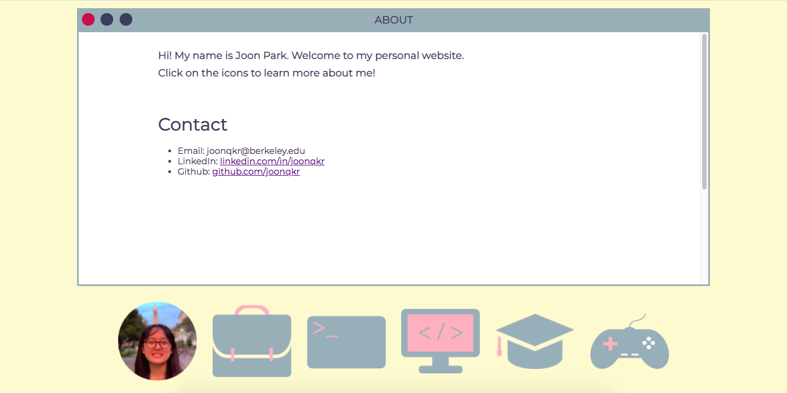

# joonqkr.github.io
Personal website.
[joonqkr.github.io](https://joonqkr.github.io/joonqkr.github.io)

## Table of Contents
* [General Info](#general-information)
* [Technologies Used](#technologies-used)
* [Screenshots](#screenshots)
* [Project Status](#project-status)
* [Room for Improvement](#room-for-improvement)

## General Information
Personal website with my occupation, education, and skills history, along with other information about myself.

## Technologies Used
- HTML
- CSS
- Javascript
- Adobe Illustrator

## Screenshots

## Project Status
Project is: _tentatively complete_.
It will be updated accordingly.

## Room for Improvement
Room for improvement:
- Windows close with animation
- Better colors
- Less boring background
